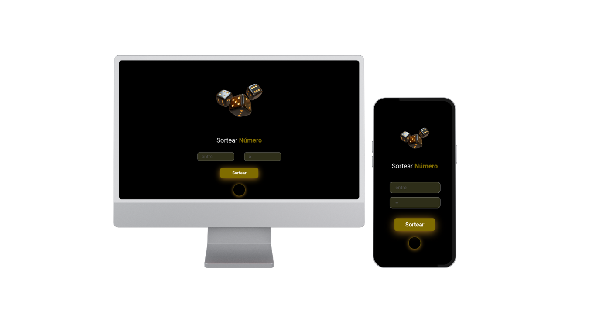

## SORTEADOR DE NÚMEROS
 

## PRATICANDO HTML5, CSS, JAVASCRIPT.

 

Este projeto nasceu de um desafio proposto durante minha formação no DevClub. Foi uma ótima oportunidade para aplicar e consolidar meus conhecimentos em HTML5, CSS e JavaScript. Embora seja um projeto simples, ele é intunitivo, funcional e reflete meu progresso na prática de desevolvimento web.

<b>Tecnologias utilizadas para o desenvolvimento do site:</b>

 
  
  
  

 

 
<b>Minhas redes:</b> 
 

